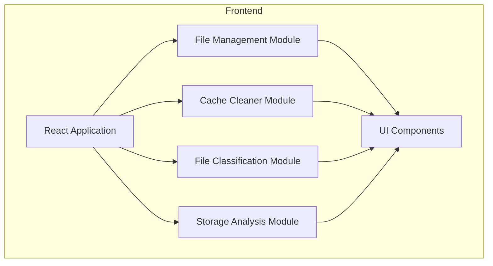

## 1. Architecture Design
这是一个纯前端React应用，专注于文件管理功能的Web应用。

## 2. Technology Description
- Frontend: React@18 + TypeScript + tailwindcss@3 + vite
- Initialization Tool: vite-init
- Backend: None
- Database: None
- State Management: zustand
- Icons: lucide-react
- Charts: recharts

## 3. Route Definitions
| Route | Purpose |
|-------|---------|
| / | 文件浏览主页 |
| /cache | 缓存清理页面 |
| /categories | 文件分类页面 |
| /storage | 存储分析页面 |

## 4. API Definitions (if backend exists)
不适用，纯前端应用。

## 5. Server Architecture Diagram (if backend exists)
不适用。

## 6. Data Model (if applicable)
不适用。

### 6.1 Data Model Definition
不适用。

### 6.2 Data Definition Language
不适用。
