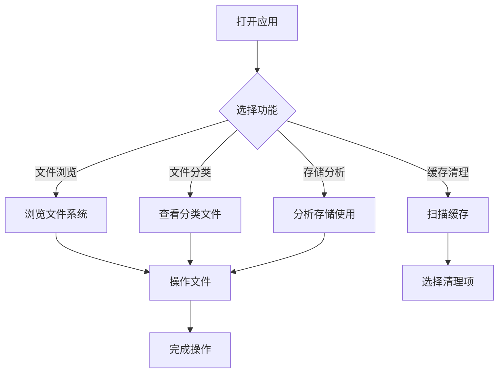

## 1. Product Overview
这是一个为安卓手机设计的功能强大的文件管理器，专注于精准分类和详细的缓存文件识别。解决了手机自带文件管理器分类粗糙、缓存文件难以清理的问题。
- 主要面向安卓手机用户，提供高效的文件管理体验
- 目标是帮助用户轻松管理、分类和清理手机文件，特别是缓存文件

## 2. Core Features

### 2.1 User Roles (if applicable)
无需用户登录，直接使用。

### 2.2 Feature Module
1. **文件浏览页面**：文件夹导航，文件列表查看，详细分类展示
2. **缓存清理页面**：智能扫描应用缓存，详细分类展示缓存类型，一键清理
3. **文件分类页面**：按文件类型（图片、视频、文档、音频、安装包等）精准分类
4. **存储分析页面**：存储使用统计，大文件识别，重复文件检测

### 2.3 Page Details
| Page Name | Module Name | Feature description |
|-----------|-------------|---------------------|
| 文件浏览页面 | 文件夹导航 | 侧边栏快速访问常用目录，面包屑导航路径显示 |
| 文件浏览页面 | 文件列表 | 支持网格/列表视图切换，文件图标与预览，排序和筛选功能 |
| 缓存清理页面 | 缓存扫描 | 扫描系统和应用缓存，详细分类（临时文件、日志、缩略图等） |
| 缓存清理页面 | 一键清理 | 选择性清理或全量清理，释放空间统计 |
| 文件分类页面 | 类型分类 | 按图片、视频、文档、音频、APK、压缩包等智能分类 |
| 存储分析页面 | 空间统计 | 饼图展示存储占用，大文件列表，重复文件提示 |

## 3. Core Process
用户打开应用 → 浏览文件或进入缓存清理 → 选择要操作的文件或缓存 → 执行删除/移动/复制等操作 → 完成操作并查看结果。

## 4. User Interface Design
### 4.1 Design Style
- 主色调：深蓝色 (#165DFF) 配合白色背景
- 按钮风格：圆角矩形，带有悬停和点击效果
- 字体：使用现代无衬线字体，清晰易读
- 布局风格：卡片式布局，侧边导航栏
- 图标风格：简洁的线条图标，配合适当的色彩

### 4.2 Page Design Overview
| Page Name | Module Name | UI Elements |
|-----------|-------------|-------------|
| 文件浏览页面 | 文件列表 | 卡片网格/列表视图，文件图标，文件名，大小，修改时间 |
| 缓存清理页面 | 缓存列表 | 应用图标，缓存大小，缓存类型说明，复选框选择 |
| 文件分类页面 | 分类网格 | 彩色分类卡片，图标，文件数量统计 |
| 存储分析页面 | 统计图表 | 饼图可视化，大文件列表，进度条 |

### 4.3 Responsiveness
移动端优先设计，优化触摸操作，适配各种屏幕尺寸。

### 4.4 3D Scene Guidance (if applicable)
不适用。
